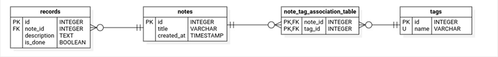
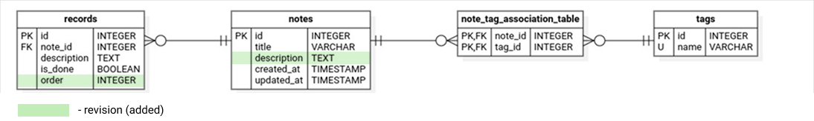

# 🧪 Example Alembic Project

This project demonstrates a minimal setup using **SQLAlchemy 2.0**, **Alembic** for migrations, and **SQLite** as the database.

It's a simple, self-contained TODOs / notes app that features:

- ✅ TODOs / Notes with multiple records (like steps or tasks)
- ✅ A tagging system (multiple tags per note)
- ✅ JSON output for filtered results

> ⚠️ **Note**: 
> This is not a complete app or a full-featured CLI app.
> This project is meant for learning purposes and can be extended into a full app.
> It's meant to demonstrate how to set up and manage database versioning with Alembic and SQLAlchemy.

---

## 🎯 Purpose

This repository serves as an example in a form of a **progressive walkthrough** for **Alembic migrations tool** — starting from a working schema and guiding you through common database development workflows using Alembic and SQLAlchemy.

You'll see examples and learn how to:

1. Initialize and run Alembic migrations
2. Seed example data
3. Query and filter related data
4. Create and modify your models (e.g., adding new fields)
5. Generate new migrations from model changes
6. Apply migrations safely
7. Observe and understand schema/data evolution

This is a great starting point if you're:
- New to SQLAlchemy 2.0 or Alembic
- Prototyping a relational app with structured migrations

---

## 📦 Features

- SQLAlchemy ORM with relationships
- SQLite database
- Alembic migrations
- Data seeding
- Queries via SQLAlchemy Core

## 📂 Project Structure

- [models.py](./src/models.py) — defines ORM models (`Note`, `Record`, `Tag`).
- [connect.py](./src/connect.py) — DB connection and session setup.
- [migrations/](./migrations/) — Alembic migration scripts directory.
- [data/](./data/) — Directory to hold the SQLite database file (empty except for `.gitkeep` to keep the `data/` directory in Git).
- [seeds.py](./src/seeds.py) — Seeds the DB with initial data.
- [main-revision-0.py](./src/main-revision-0.py) — Queries notes with the query to retrieve seeded data (db schema revision 0 - initial).
- [main-revision-1.py](./src/main-revision-1.py) — Queries notes with the query to retrieve seeded data (db schema revision 1 - added note description and record order).

## 🛠️ Setup

### 1. Install dependencies

```bash
poetry install
```

This will install all necessary project dependencies.

### 2. Initialize the database and run migrations

```bash
poetry run alembic upgrade head
```

This will create the SQLite database `mynotes.db` inside the `data/` directory and apply all currently available migrations (this will bring your database to revision 0, representing the initial schema version used in this project).

Current database structure is based on provided ORM models located in `src/models.py`.

Initial revision database schema:



### 3. Seed the database

```bash
poetry run python ./src/seeds.py
```

This will add sample data to the database tables.

> **Note**: To rerun `seeds.py`, you'll need to delete `data/mynotes.db` file and initialize the database (previous step) again.

### 4. Run the sample query to test if everything is working

> **Note**: Make sure your database file exists under `data/` before querying using `main-revision-0.py`.

```bash
poetry run python ./src/main-revision-0.py
```

This will show current notes data, filtered by "food" and "cooking" tags and displayed in JSON format for easier reading.

<details> <summary>Click to expand and see easy to read JSON-like output</summary>

```bash
✅ Showing notes related to tags: food, cooking
[
  {
    "note_id": 1,
    "title": "Buy ingredients for supper",
    "created_at": "2025-07-30T14:35:15",
    "updated_at": "2025-07-30T14:35:15",
    "tags": [
      "food",
      "groceries"
    ],
    "records": [
      {
        "description": "Buy chicken breast, 500g",
        "is_done": false
      },
      {
        "description": "Buy potatoes, 1kg",
        "is_done": false
      },
      {
        "description": "Buy garlic and parsley",
        "is_done": false
      },
      {
        "description": "Buy sour cream",
        "is_done": false
      }
    ]
  },
  {
    "note_id": 2,
    "title": "Cook supper: Chicken with potatoes",
    "created_at": "2025-07-30T14:35:15",
    "updated_at": "2025-07-30T14:35:15",
    "tags": [
      "cooking",
      "dinner"
    ],
    "records": [
      {
        "description": "Clean and slice the potatoes, 1kg",
        "is_done": false
      },
      {
        "description": "Season the chicken breast (500g) and fry lightly",
        "is_done": false
      },
      {
        "description": "Bake everything together for 60 minutes at 180°C",
        "is_done": false
      },
      {
        "description": "Garnish with parsley and serve",
        "is_done": false
      }
    ]
  }
]
```
</details>

## 📘 Schema Change & Revision Walkthrough

This guide will walk you through a staged database evolution process using Alembic. You'll start with a minimal schema and later upgrade it via revision-based migrations.

The following shows database versioning in case of any changes to ORM models.

1. **Step 1: Modify the models**

    > ℹ️ If you want to continue evolving the schema, you can introduce your own changes to the ORM models after and follow the same revision process starting from this point.

    Some changes have already been made to the models to demonstrate this step:

    - Added `description` field to `Note` - adds broader text description to a note
    - Added `order` field to `Record` - helps to prioritize records, mark them as completed, etc.

    First revision database schema:

    

    <details> <summary>Click to expand and see easy to read JSON-like output</summary>

    ```bash
    ...
    ```
    </details>

2. **Step 2: Generate a new revision**

    ```bash
    poetry run alembic revision --autogenerate -m "Your message"
    ```

    > **Note**:
    > Add your own message after `-m`, describing what has been changed after previous revision.

    This creates a new file in `migrations/versions/`.
    
    This step only generates a migration script. The database structure itself is not changed until you apply the migration.

3. **Step 3: Apply the migration**
    
    ```bash
    poetry run alembic upgrade head
    ```

    This applies the suggested changes and updates the database structure.

4. **Step 4: Update seeding and querying (optional)**

    Now that the database structure has changed, you may want to update your seeding and querying logic to reflect these changes.

5. **Run the sample query to test if everything is working**

```bash
poetry run python ./src/main-revision-1.py
```

This will show current notes data, filtered by "food" and "cooking" tags and displayed in JSON format for easier reading.


## ↩️ Reverting changes

If something went wrong, to roll back the last change:

```bash
poetry run alembic downgrade -1
```

This will revert database schema, but seeded data (unless removed manually) will stay.

> ℹ️ This rolls back just the *last* applied migration.
> You can chain this with multiple `-1` steps or use full revision identifiers as needed.


> ⚠️ **Caution**:
> Downgrading may lead to data loss — for example, if you added a new column and inserted data into it, the column (and its data) will be removed.
> If necessary, please consider making backups before any risky changes.


## ⚙️ Requirements

* [Python 3.11+](https://www.python.org/downloads/) (tested on 3.12.11)
* [Poetry](https://python-poetry.org/) (tested on 2.1.3)
* [Alembic](https://alembic.sqlalchemy.org/en/latest/) (tested on 1.16)

## 📄 License

[MIT License](./LICENSE) · Happy hacking!
